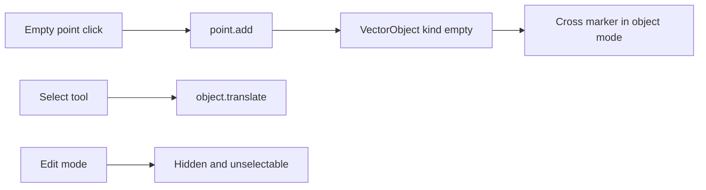

# Інструмент Empty point

Точка живе в `document.objects` як звичайний об’єкт із дискримінатором `kind: 'empty'`, порожнім шляхом і позицією в `transform`. Переміщення йде наявним `object.translate` (і числовими X/Y в опціях). Прив’язку як «дочку відліку» в модифікаторах не додаємо.

## Модель

У [`src/app/core/model/types.ts`](src/app/core/model/types.ts) додати `kind: 'path' | 'empty'` на `VectorObject`. Для наявних літералів і SVG без поля трактувати відсутній `kind` як `'path'` на імпорті; у коді створення шляхів (`pen-path`, `document-edits`, `create-document`) явно ставити `'path'`.

Нова функція поруч із [`pen-path.ts`](src/app/core/model/pen-path.ts): `addEmptyPoint(document, position, layerId)` створює об’єкт `Point N`, `kind: 'empty'`, порожній `source`, без заливки/обведення, `modifiers: []`, `transform` з `x`/`y` у точці кліку. Хелпер `isEmptyPoint`.

Команда `{ type: 'point.add'; position: Vec2 }` у [`command.ts`](src/app/commands/models/command.ts), обробник у [`session.service.ts`](src/app/core/session.service.ts): лишає `mode: 'object'`, виділяє нову точку. Історія: «Add empty point» у [`history.ts`](src/app/commands/models/history.ts).

## Інструмент

- `EditorTool`: `'empty-point'`, підпис `Empty point`, шорткат `E` у [`editor-tools.ts`](src/app/commands/models/editor-tools.ts), [`command.ts`](src/app/commands/models/command.ts) і [`keymap.service.ts`](src/app/keymap/services/keymap.service.ts). Іконка `&#xe10B;` у тій самій послідовності, що й інші інструменти; рейка і панель інструментів підхоплять її з `EDITOR_TOOLS`.
- У [`viewport.ts`](src/app/viewport/components/viewport/viewport.ts) клік лівою кнопкою в object mode диспатчить `point.add` у `pointerToDocument`. Курсор `crosshair`, як у pen.

## Сцена і виділення

- [`scene.ts`](src/app/viewport/utils/scene.ts) не малює empty як `<path>`.
- Окремий оверлей у [`viewport.html`](src/app/viewport/components/viewport/viewport.html): хрест у `(transform.x, transform.y)`, радіус у екранних пікселях (як rotation origin). Лише коли `mode === 'object'`. Виділена точка — акцентний колір.
- Empty не показує rotation-origin handle.
- [`hit-test.ts`](src/app/viewport/utils/hit-test.ts): влучання в радіус ~8px / zoom; marquee включає точку, якщо її позиція всередині прямокутника. Далі працює наявний select/move.

## Edit mode

У [`applyMode`](src/app/core/session.service.ts) при вході в `edit` прибрати empty з `selectedObjectIds` і `activeObjectId`. `session.select` на empty в edit mode ігнорувати. Outliner у [`outliner-panel.ts`](src/app/panels/outliner/components/outliner-panel/outliner-panel.ts) не показує їх в edit mode. Direct select, pen і add-point їх не чіпають, бо активного шляху немає.

## Модифікатори

- [`addModifier`](src/app/core/model/modifier-edits.ts) і команди `modifier.*` для empty — no-op.
- Панель модифікаторів: якщо активний empty, текст «Modifiers do not apply to empty points» замість кнопки Add.
- Boolean `peers` не включає empty, щоб точку не можна було взяти операндом.
- `evaluate` для empty повертає порожнє джерело і не йде по стеку.

## Збереження

У [`svg-export.ts`](src/app/core/io/svg-export.ts) / [`svg-import.ts`](src/app/core/io/svg-import.ts) писати й читати `kind`. Для empty у SVG — `<path d="M x y" fill="none" stroke="none">` плюс metadata, щоб all/optimized round-trip зберігав точку. Старі файли без `kind` лишаються шляхами.

## Перевірка

Тести: створення і виділення, no-op модифікатора, hit-test/marquee, скидання виділення в edit mode, SVG round-trip. Потім у браузері: поставити точку, перетягнути Select-ом, перейти в edit (точки немає), повернутись в object (точка на місці), переконатись, що панель модифікаторів її не приймає.