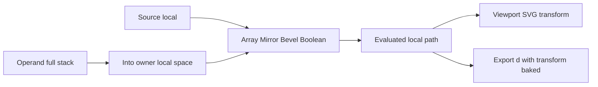

# Фаза 10. Bevel і Boolean

Обсяг із [implementation.plan.md](c:\Projects\vscode-tools\vector-editor\.cursor\plans\implementation.plan.md): flatten, `clipper2-ts`, діагностика відкритого шляху і циклу, дірки як підшляхи з `evenodd`. Array і Mirror не змінюють формулу.

Новий пакет — `clipper2-ts` (BSL-1.0, уже прийнятий у загальному плані). Виклики: `inflatePaths`, `union`, `difference`, `intersect`, `FillRule`, `JoinType`, `EndType`.

## Простір

Крок лишається в локальному просторі, як Array і Mirror. Viewport і далі малює локальний `d` і накладає SVG-transform із [scene.ts](c:\Projects\vscode-tools\vector-editor\src\app\viewport\scene.ts). Export запікає ту саму матрицю в `d`.

Boolean бачить operand там, де він стоїть на полотні. Evaluated operand (його повний стек) переводиться матрицею `inverse(transform хазяїна) × transform operand`. Далі крок пише локальний результат, і transform хазяїна знову везе його разом з об’єктом. Array після Boolean копіює вже вирізану ламану в локальних одиницях.

Нульовий масштаб хазяїна не має оберненої матриці: крок пропускається, у діагностиці текст, геометрія входу лишається. `invertMatrix` додається поруч із [matrix.ts](c:\Projects\vscode-tools\vector-editor\src\app\core\io\matrix.ts).

## Хто рахує

`evaluateObject` бачить один об’єкт і не може знайти operand. Його замінює `evaluateDocument(objects)`: спочатку повний стек operand, потім хазяїн. Цикл A→B→A виявляється по `operandId` до виклику Clipper. Результат на об’єкт: підшляхи, діагностика, `fillRule`.

Усередині стека порядок той самий: індекс 0 перший, `enabled: false` пропускає крок. Array і Mirror лишаються чистими функціями. Bevel і Boolean ріжуть поточний вхід.

**Flatten.** Кубічний сегмент ділиться, поки відхилення від хорди більше за 0.25 локальної одиниці. `line` лишається відрізком. Перед Clipper координати множаться на 1000 і округлюються; після діляться назад. Живий evaluated не кличе `createId()`: id точок ламаної детерміновані від id модифікатора й індексу, як репліки Array.

**Bevel.** `distance: 0` повертає вхід. Замкнений шлях — `EndType.Polygon` і знакова дистанція (`JoinType` Bevel, Miter, Round, `miterLimit`). Відкритий шлях — `EndType.Round` і модуль дистанції: evaluated стає замкненою смугою навколо лінії, `source` до Apply лишається відкритим. Після Bevel у стеку лише `line`.

**Boolean.** `union`, `difference`, `intersect`. Відкритий підшлях у поточному вході хазяїна або в переведеному operand: крок не міняє геометрію і пише діагностику. Те саме для відсутнього operand, operand що збігається з хазяїном, циклу і незворотної матриці. Operand лишається окремим видимим об’єктом. Порожній результат Clipper — порожній шлях без діагностики. Вихід — замкнені підшляхи з `line`.

**fillRule.** Якщо хоч один Boolean у стеку реально виконався, evaluated `fillRule` — `evenodd`. Інакше лишається `style.fillRule`. [scene.ts](c:\Projects\vscode-tools\vector-editor\src\app\viewport\scene.ts) і hit-test малюють і ловлять клік цим правилом, тож отвір і прозорий для влучання. `modifier.apply` і `modifier.applyAll` записують `evenodd` у `style`, коли запечений префікс містив виконаний Boolean: після зникнення стека дірка лишається.

## Жест

Clipper не ганяється на кожен `pointermove`. У [SessionService](c:\Projects\vscode-tools\vector-editor\src\app\core\session.service.ts) сигнал тримає знімок виходу кожного Bevel і Boolean, знятий до першої команди жесту. У знімок History він не входить.

[viewport.ts](c:\Projects\vscode-tools\vector-editor\src\app\viewport\viewport.ts) вмикає знімок перед першим зсувом перетягування об’єкта, якоря, handle або пера і скидає його на `pointerup` і `pointercancel`. Поки знімок живий, Array і Mirror рахуються одразу, а Bevel і Boolean підставляють збережений вихід. Панорама знімка не ставить. Поле Options і правка параметра модифікатора рахують Clipper одразу: там `gesture: 'begin'` означає один крок, а не перетягування.

Export і Apply знімок ігнорують.

## Панель і команди

`modifier.add` приймає ще `bevel` і `boolean`. Типові значення: Bevel `distance: 8`, `join: 'bevel'`, `miterLimit: 4`; Boolean `operation: 'difference'` і перший інший об’єкт, або порожній `operandId`, якщо іншого немає.

[ModifierPatch](c:\Projects\vscode-tools\vector-editor\src\app\core\model\modifier-edits.ts) отримує `distance`, `join`, `miterLimit`, `operation`, `operandId`. Порожнє числове поле панель не шле. `distance` і `miterLimit` лишаються скінченними числами.

У [modifiers-panel.html](c:\Projects\vscode-tools\vector-editor\src\app\panels\modifiers\components\modifiers-panel.html) кнопки Add bevel і Add boolean. Рядок Bevel: дистанція, три радіо Join, Miter limit лише для `miter`. Рядок Boolean: три радіо операції і `select` інших об’єктів за іменем. Числа — Signal Forms, у документ на blur або Enter. Гілка «not available yet» у [modifier-row.html](c:\Projects\vscode-tools\vector-editor\src\app\panels\modifiers\components\modifier-row.html) зникає. Діагностика вже виводиться під стеком; вона читає `evaluateDocument`, а не один об’єкт.

## Файли

`d` в All data і Optimized — evaluated плюс transform. `fill-rule` на елементі — evaluated правило, щоб отвір був видний поза редактором. All data зберігає `operandId`. Optimized не має id об’єктів, тому Boolean пише `operandIndex` у порядку запису path; імпорт після нових id збирає посилання назад. Битий індекс відкидає елемент, як і зараз битий модифікатор. Minimal лишається без JSON: у файлі запечена ламана і `evenodd`, якщо Boolean виконався.

[svg-import.ts](c:\Projects\vscode-tools\vector-editor\src\app\core\io\svg-import.ts) починає читати `bevel` і `boolean`. Тест, який їх відкидає, змінюється на відновлення.

Apply як і раніше кличе `remintSource`: після запікання якорі нові, виділення якорів активного об’єкта скидається, сегменти прямі.

## Перевірка

Юніти eval: квадрат з Bevel `join: 'bevel'` дає зрізаний кут; відкритий шлях стає замкненою смугою; difference двох квадратів дає отвір і `evenodd`; union і intersect мають різний bounds; відкритий шлях, відсутній operand, сам на себе і цикл не міняють вхід і пишуть діагностику; Array після Boolean копіює ламану. Apply запікає `line`, ставить `evenodd` і прибирає префікс. Знімок жесту: зсув джерела не міняє вихід Boolean, зсув Array міняє копії, скидання знімка перераховує отвір.

Юніти io: All data відновлює Bevel, Boolean і `operandId`; Optimized зводить operand на новий id; Minimal не пише атрибут редактора і кладе evaluated `d`.

У браузері: difference вирізає отвір, клік у отвір не виділяє хазяїна; union і intersect відрізняються; Bevel зрізає кути; відкритий шлях у Boolean показує текст і не міняє форму; перетягування operand не смикає отвір до відпускання; Apply лишає ламану після зникнення рядка; Save All data відкривається зі стеком, а `d` у звичайному переглядачі показує отвір.
