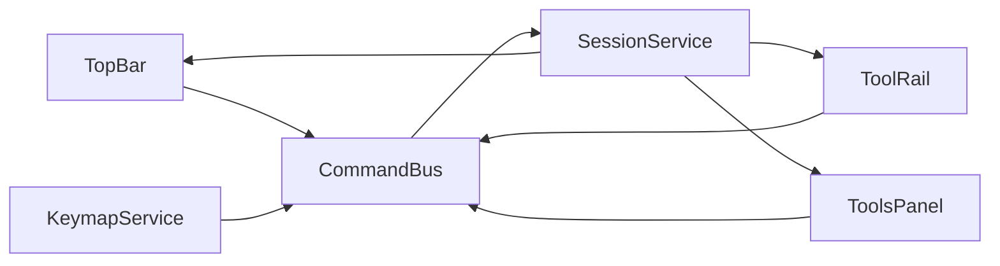

# Фаза 1. Оболонка і шина команд

Обсяг із [implementation-plan.md](c:\Projects\vscode-tools\vector-editor\.cursor\plans\implementation-plan.md): макет на всю висоту, вісім секцій з порожнім станом, ліва колонка, верхня смуга, viewport як один tab stop. Сесія тримає лише режим і інструмент. Документ, камера, History, hit-test і файл у цю фазу не входять.

Порожні `NgModule` у `core`, `shared`, `viewport` і `panels/*` суперечать [AGENTS.md](c:\Projects\vscode-tools\vector-editor\AGENTS.md). Їх прибираємо. Панелі вже мають порожні [components/index.ts](c:\Projects\vscode-tools\vector-editor\src\app\panels\tools\components\index.ts) — заглушки кладемо туди і реекспортуємо з `panels/<name>/index.ts`.

## Потік

UI читає signals і лише викликає `dispatch`. `SessionService.apply` замінює зріз `{ mode, tool }` новим об’єктом. History з фази 3 огорне цей самий `dispatch`, тому знімків зараз немає.

Команди фази 1 у [src/app/commands/command.ts](c:\Projects\vscode-tools\vector-editor\src\app\commands\command.ts):

- `session.setMode` з `mode: 'object' | 'edit'`
- `session.setTool` з `tool: 'select' | 'direct-select' | 'pen'`

Кнопка режиму і Tab читають поточний `mode()` і шлють протилежне значення. Окремої команди toggle немає: у каталозі лише `setMode`.

## Сесія і клавіатура

- [src/app/core/session.service.ts](c:\Projects\vscode-tools\vector-editor\src\app\core\session.service.ts) — `@Service()`, signals `mode` (старт `'object'`) і `tool` (старт `'select'`), метод `apply`.
- [src/app/commands/command-bus.service.ts](c:\Projects\vscode-tools\vector-editor\src\app\commands\command-bus.service.ts) — `@Service()`, `dispatch(command)` викликає `session.apply`.
- [src/app/keymap/keymap.service.ts](c:\Projects\vscode-tools\vector-editor\src\app\keymap\keymap.service.ts) — слухач `keydown` через `DOCUMENT` і `DestroyRef`, без `@HostListener`. Сторінка редактора інжектить сервіс, щоб слухач піднявся.
- V, A, P ігноруються в `input`, `textarea`, `select` і `contenteditable`, а також з Ctrl, Alt або Meta.
- Tab обробляється лише коли фокус на елементі з `data-viewport`: `preventDefault`, режим міняється, фокус лишається на полотні. У панелях Tab не перехоплюється.

## Макет

Єдиний маршрут `''` у [app.routes.ts](c:\Projects\vscode-tools\vector-editor\src\app\app.routes.ts) ліниво вантажить `EditorPage`. [app.ts](c:\Projects\vscode-tools\vector-editor\src\app\app.ts) лишає лише `RouterOutlet`. Корінь, `html` і `body` на всю висоту.

Сітка `100dvh`: верхня смуга на всю ширину; нижче колонки — рейка 3rem, полотно `1fr`, панелі близько 18rem.

- **Top bar** (`banner`): New, Open, Save, Undo, Redo видимі й `disabled` (їхні команди — фази 2, 3 і 8). Кнопка режиму показує `Object` або `Edit` і шле `session.setMode`. Підпис у `aria-live="polite"`.
- **Tool rail** (`nav`, ім’я Tools): Select, Direct select, Pen. `aria-pressed` від `tool()`.
- **Viewport**: біле полотно, `tabindex="0"`, `data-viewport`, `aria-label="Canvas"`. Один tab stop, без `role="application"`.
- **Панелі** (`aside`): Outliner, Options, Modifiers, Tools, Color, Color Collections, Preview, History. Кожна — `<section>` з заголовком і текстом порожнього стану. Секція Tools дублює три кнопки рейки і шле ті самі команди. Заголовок секції модифікаторів — Modifiers.

Компоненти маленькі й standalone, стилі SCSS поруч із TS. Сигнали через `inject()`, шаблони з `@if`. Токени кольору в [styles.scss](c:\Projects\vscode-tools\vector-editor\src\styles.scss): темна оболонка, біле полотно. Кільце фокуса `:focus-visible` має контраст і на темному хромі, і на білому полотні (темний контур плюс світлий ореол).

## Прибирання каркаса

Видалити `*.module.ts` і каталог [src/app/shared](c:\Projects\vscode-tools\vector-editor\src\app\shared). У [tsconfig.json](c:\Projects\vscode-tools\vector-editor\tsconfig.json) лишити `@vector-editor/core` і виправити `@vector-editor/viewport` на [src/app/viewport/index.ts](c:\Projects\vscode-tools\vector-editor\src\app\viewport\index.ts). Прибрати аліаси `shared` і `models`: файлів за ними немає.

## Перевірка

- Замінити [app.spec.ts](c:\Projects\vscode-tools\vector-editor\src\app\app.spec.ts): застосунок створюється, очікування `h1` «Hello, vector-editor» зникає.
- Окремий spec на `CommandBus`: `setTool` і `setMode` міняють signals.
- У браузері: сторінка на всю висоту; фокус видно на полотні, кнопці режиму і кнопках інструментів; Tab на полотні міняє підпис режиму і не йде в панелі; та сама кнопка робить те саме; V, A, P міняють інструмент і `aria-pressed` на рейці та в секції Tools; Tab у панелях ходить по кнопках інструментів, не перемикаючи режим.
