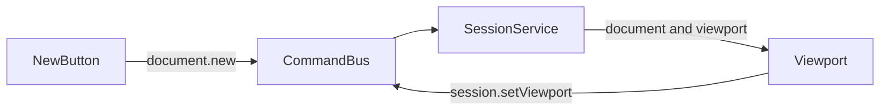

# Фаза 2. Документ і камера

Обсяг із [implementation-plan.md](c:\Projects\vscode-tools\vector-editor\.cursor\plans\implementation-plan.md): типи моделі, `document.new`, один тестовий кубічний шлях, малювання `source` у SVG, pan і zoom. Виділення, History, hit-test, якорі, перо, колір і файл лишаються у фазах 3–8. Open, Save, Undo і Redo у [top-bar.html](c:\Projects\vscode-tools\vector-editor\src\app\shell\top-bar\top-bar.html) лишаються `disabled`.

Зараз [SessionSlice](c:\Projects\vscode-tools\vector-editor\src\app\core\session.service.ts) тримає лише `mode` і `tool`, [Command](c:\Projects\vscode-tools\vector-editor\src\app\commands\command.ts) має два варіанти, [Viewport](c:\Projects\vscode-tools\vector-editor\src\app\viewport\viewport.ts) — порожній host з `tabindex="0"` і `data-viewport`.

## Потік

UI як і раніше лише читає signals і викликає `dispatch`. `applySessionCommand` лишається чистою заміною зрізу. Знімків History немає: їх підключить фаза 3 до того самого `dispatch`.

До сесії додаються два поля:

- `document: Document | null` — `null`, доки не натиснуто New
- `viewport: { panX, panY, zoom }` — старт `0, 0, 1`

`document.new` замінює лише документ. Режим і інструмент не чіпає. `session.setViewport` замінює лише камеру і в History не піде.

## Модель

Новий каталог [src/app/core/model](c:\Projects\vscode-tools\vector-editor\src\app\core\model). Типи — контракт із загального плану, навіть якщо стек і зразки поки порожні: `Document`, `Layer`, `VectorObject`, `ObjectTransform`, `Style`, `SourcePath`, `Subpath`, `Anchor`, `Segment`, дискримінант `Modifier`, `Swatch`, `ViewBox` як `{ x, y, width, height }`. Оновлення лише новими об’єктами. Ідентифікатори — `crypto.randomUUID()`.

`createNewDocument()`:

- ім’я `Untitled`, `viewBox` `{ x: 0, y: 0, width: 1200, height: 800 }`
- один шар, один об’єкт, identity-transform, порожній `modifiers`, порожні `swatches`
- один замкнений підшлях із чотирьох якорів і чотирьох сегментів `cubic`, handles абсолютні в локальному просторі
- форма по центру аркуша (приблизно 250–820 по x і 180–640 по y), `fill` світло-сіро-блакитний, `stroke` темний, `strokeWidth` 4, `fillRule: 'nonzero'`

Чиста `sourceToPathData(source)` будує атрибут `d`: `M`, `L` або `C`, `Z` для `closed`. Відсутній handle збігається з якорем. Цю функцію пізніше візьме експорт.

## Камера

Чисті функції в `src/app/viewport/camera.ts`:

- `fitArtboard(viewSize, viewBox, padding)` — масштаб, щоб увесь аркуш умістився з полем близько 24px, вирівнювання по центру
- `zoomAtPoint(viewport, cursor, factor)` — точка документа під курсором лишається на місці; zoom затиснутий приблизно від `0.02` до `64`
- `panBy(viewport, dx, dy)` — зсув у пікселях екрана

Екранна точка `(sx, sy)` відповідає документу `((sx - panX) / zoom, (sy - panY) / zoom)`. У SVG це група `translate(panX panY) scale(zoom)` у системі координат host: розмір SVG дорівнює полотну, окремого `viewBox` на корені немає.

Після зміни `document.id` viewport один раз шле `session.setViewport` з результатом `fitArtboard`, коли в host уже є ненульовий розмір. Повторний New дає новий id і знову вписує аркуш. Ресайз вікна камеру не перераховує.

## Малювання

[Viewport](c:\Projects\vscode-tools\vector-editor\src\app\viewport\viewport.ts) лишає один tab stop на host. Усередині — `<svg>` на всю площу, без власного фокуса, `aria-hidden="true"` (оголошення виділення буде в фазі 11, шлях до нього — Outliner).

- Фон host стає сірим столом (новий токен, наприклад `--desk`). Білий прямокутник `viewBox` — сам аркуш, обводка `non-scaling-stroke`, щоб край було видно під час pan.
- Кожен видимий об’єкт — `<g>` з його `transform` (`translate`, `rotate`, `scale` навколо локального нуля) і один `<path>` з `sourceToPathData`. Якорів і handles немає.
- Невидимий об’єкт не малюється. Порожній `document === null` — лише стіл, без аркуша.

## Жести

Слухачі на host-об’єкті компонента, без `@HostListener`. [KeymapService](c:\Projects\vscode-tools\vector-editor\src\app\keymap\keymap.service.ts) не змінюється: пробіл діє лише коли фокус уже на полотні.

- `wheel` над полотном завжди `preventDefault`, включно з Ctrl, щоб сторінка браузера не масштабувалась. Множник від `deltaY` (з урахуванням `deltaMode`) іде в `zoomAtPoint`, далі `session.setViewport`.
- Середня кнопка: `pointerdown` з `setPointerCapture`, `panBy` на русі, `grabbing` на час жесту. `auxclick` теж скасовується, щоб браузер не вмикав autoscroll.
- Пробіл у фокусі viewport: `preventDefault` на `keydown`/`keyup` (повтор клавіші ігнорується). Поки пробіл затиснутий, ліва кнопка панорамує тим самим `panBy`.

Жест тримається локальним станом компонента. У сесію на кожен рух іде лише нова камера.

## Кнопка New

У [top-bar.ts](c:\Projects\vscode-tools\vector-editor\src\app\shell\top-bar\top-bar.ts) кнопка New вмикається і шле `{ type: 'document.new' }`. Підпис лишається текстом кнопки.

## Перевірка

Юніт-тести:

- `createNewDocument`: 1200×800, один шар, один об’єкт, замкнений підшлях, усі сегменти `cubic`
- `sourceToPathData` на фіксованих якорях дає очікуваний `d`
- `zoomAtPoint` зберігає точку під курсором; `fitArtboard` вміщує аркуш у заданий розмір
- `CommandBus`: `document.new` кладе документ і не скидає mode/tool; `session.setViewport` міняє лише камеру

У браузері: до New полотно порожнє; після New видно аркуш і заливку кривої; колесо збільшує до курсора; середня кнопка і пробіл із перетягуванням (фокус на полотні) зсувають аркуш; Ctrl+колесо не масштабує сторінку; Tab і V/A/P працюють як у фазі 1; Open, Save, Undo, Redo неактивні.
