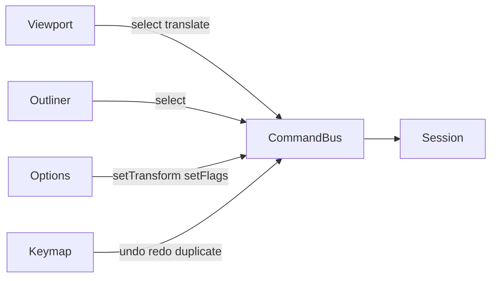

# Фаза 3. Object Mode

Обсяг із [implementation.plan.md](c:\Projects\vscode-tools\vector-editor\.cursor\plans\implementation.plan.md): hit-test заливка/обвідка, рамка, `session.select`, переміщення жестом одним записом History, Outliner, Options об’єкта, Ctrl+Z. Додатково в цю фазу входить `object.duplicate` (Shift+D): New лишає одну криву, копія дає другий об’єкт для Shift-виділення.

Якорі, direct select, перо, G/R/S, Delete, око і замок в Outliner, панель History і файл лишаються у фазах 4–8. Open і Save у [top-bar.html](c:\Projects\vscode-tools\vector-editor\src\app\shell\top-bar\top-bar.html) лишаються `disabled`.

Зараз [SessionSlice](c:\Projects\vscode-tools\vector-editor\src\app\core\session.service.ts) тримає `mode`, `tool`, `document` і камеру. [Command](c:\Projects\vscode-tools\vector-editor\src\app\commands\command.ts) не має виділення. [Viewport](c:\Projects\vscode-tools\vector-editor\src\app\viewport\viewport.ts) малює `source` і панорамує; ліва кнопка без пробілу нічого не робить. [KeymapService](c:\Projects\vscode-tools\vector-editor\src\app\keymap\keymap.service.ts) відкидає будь-який Shift і Ctrl.

## Потік

UI як і раніше лише читає signals і викликає `dispatch`. `applySessionCommand` лишається чистою заміною зрізу. History огортає цей самий `dispatch`: знімок знімається до команди, у знімок входять `document`, `mode` і виділення. Камера, інструмент і відкритий жест у знімок не входять.

## Сесія і команди

До [SessionSlice](c:\Projects\vscode-tools\vector-editor\src\app\core\session.service.ts) додається виділення:

- `activeObjectId: string | null`
- `selectedObjectIds: readonly string[]`
- `editSelectionKind: 'anchor' | 'segment'` (старт `'anchor'`, фаза 3 його не міняє)
- `selectedAnchorIds` і `selectedSegmentIds` — порожні масиви, щоб знімок History не міняв форму у фазі 4

`document.new` замінює документ і скидає виділення. Режим, інструмент і камеру не чіпає.

Нові команди в [command.ts](c:\Projects\vscode-tools\vector-editor\src\app\commands\command.ts):

- `session.select` — `target: 'object'`, `ids`, `op: 'replace' | 'add' | 'toggle' | 'clear'`. Невідомі id ігноруються. `replace` і `add`: останній новий id стає `activeObjectId`. `clear` скидає активний і виділення якорів. Якщо зріз виділення не змінився, `applySessionCommand` повертає той самий state, і History запис не створює.
- `object.translate` — `ids`, `dx`, `dy`, `gesture: 'begin' | 'continue'`. Зсуває `transform.x/y` у просторі документа. `locked` пропускає. Нульовий зсув state не міняє.
- `object.setTransform` — `ids` і частковий `ObjectTransform`. Одна команда пише лише передані поля всім id, решта каналів лишається. Так Enter у полі X не затирає rotation сусідів і дає один запис History.
- `object.setFlags` — `ids` і часткові `name`, `visible`, `locked`.
- `object.duplicate` — `ids`.
- `history.undo` і `history.redo`.

`session.setMode`, `session.setTool` і `session.setViewport` History не пишуть. Виділення об’єктів при зміні режиму зберігається.

## History

Чисті функції в [src/app/commands/history.ts](c:\Projects\vscode-tools\vector-editor\src\app\commands\history.ts). Запис: `{ label, before, after }`, де обидва знімки — `{ document, mode, selection }`. `index` вказує на поточний запис (`-1`, доки історії немає). Записи після `index` — гілка redo.

[CommandBus](c:\Projects\vscode-tools\vector-editor\src\app\commands\command-bus.service.ts):

- `history.undo` підставляє `before` поточного запису і зменшує `index`. `history.redo` підставляє `after` наступного.
- Інша команда, яка змінила знімок, відрізає redo і додає запис. Мітки англійською, як решта UI: `New document`, `Select`, `Move`, `Set transform`, `Rename`, `Show`/`Hide`, `Lock`/`Unlock`, `Duplicate`.
- `object.translate` з `gesture: 'continue'` замінює `after` останнього запису, якщо `index` на кінці списку і мітка цього запису `Move`. Інакше це новий `Move`. Перший рух жесту шле `begin`.

Жест тримає Viewport локально, як pan. `pointerup` команду не шле.

## Duplicate

Чиста функція поруч із моделлю, наприклад [src/app/core/model/duplicate-objects.ts](c:\Projects\vscode-tools\vector-editor\src\app\core\model\duplicate-objects.ts). Для кожного id, у порядку масиву:

- новий id об’єкта, нові id якорів і сегментів, `fromId`/`toId` перезібрані;
- `source`, `style`, прапори і шар ті самі; `transform.x/y` збільшені на 24, щоб копію можна було клікнути окремо;
- модифікатори копіюються з новими id; `operandId` boolean переводиться на копію, якщо operand теж у цьому наборі;
- копія додається в кінець `objects`, тож малюється поверх джерела;
- ім’я: `${name} copy`.

Після команди виділення замінюється на нові id, активний — останній. Shift+D без виділення нічого не шле.

## Hit-test і інструмент Select

Чисті функції в [src/app/viewport/hit-test.ts](c:\Projects\vscode-tools\vector-editor\src\app\viewport\hit-test.ts). Без canvas і без `isPointInFill`: jsdom їх не дає, а тести мають лишатися детермінованими.

Порядок малювання спільний для [scene.ts](c:\Projects\vscode-tools\vector-editor\src\app\viewport\scene.ts) і hit-test: шари за зростанням `order`, об’єкти шару в порядку масиву `objects`, видимі. Пізніший об’єкт зверху. Hit-test іде зверху вниз. Приховані не беруть участі.

Точка екрана переводиться в документ уже наявною формулою камери `((sx - panX) / zoom, (sy - panY) / zoom)`. Далі інверсія transform об’єкта. Атрибут лишається `translate rotate scale`, тобто локальна точка спочатку масштабується, потім обертається, потім зсувається. Нульовий scale — промах.

У локальному просторі кубічні ріжуться адаптивно, поки відхилення більше за приблизно 0.75 екранного пікселя. Заливка — промінь із `fillRule` (відкритий підшлях для заливки замикається, як у SVG). Обвідка — відстань до ламаної не більша за `strokeWidth / 2`. Влучання в заливку або обвідку виділяє об’єкт.

Рамка: AABB контрольних точок (крива лежить у їхній опуклій оболонці) з полем обвідки. Об’єкт перетинає прямокутник рамки в просторі документа. Активним стає верхній із влучених.

[Viewport](c:\Projects\vscode-tools\vector-editor\src\app\viewport\viewport.ts) обробляє ліву кнопку лише коли `tool === 'select'` і `mode === 'object'`. Пробіл і середня кнопка лишаються pan.

- Поріг близько 4px відділяє клік від жесту.
- `pointerdown` по об’єкту: якщо він не виділений, `replace` (із Shift — `add`) одразу, щоб перетяг рухав уже нове виділення. Якщо виділений, склад не чіпає. `locked` виділяється, але перетяг не починає.
- Перетяг виділених шле `object.translate`: перший рух `begin`, далі `continue`. `dx/dy` — зсув від точки натискання в одиницях документа (`screenDelta / zoom`). `setPointerCapture`. Курсор `grabbing` на час жесту.
- `pointerdown` по порожньому і рух далі за поріг малює рамку. На `pointerup` без Shift — `replace`, із Shift — `add`. Клік по порожньому без Shift — `clear`; із Shift — нічого.
- Direct select, Pen і Edit Mode у цій фазі полотно не чіпають.

Виділення видиме: другий `<path>` без заливки, обводка `#1d4ed8`, `non-scaling-stroke`, `pointer-events: none`. Рамка — прямокутник у тій самій групі камери. Геометрія хіт-тесту від DOM не залежить, тож оверлей кліки не перехоплює.

## Outliner і Options

[outliner-panel.ts](c:\Projects\vscode-tools\vector-editor\src\app\panels\outliner\components\outliner-panel.ts): без документа лишається «No objects yet.» З документом — `role="tree"`. Шар — `treeitem` з `aria-expanded`; клік згортає його об’єкти. Об’єкти шару зверху вниз (зворотний порядок малювання). Клік по об’єкту шле `session.select` (`replace`, із Shift — `add`). `aria-selected` від виділення, активний позначений класом. Стрілки рухають фокус по рядках (`tabindex` 0 лише на поточному), Enter виділяє об’єкт через `replace`. Око і замок у рядку не додаються: це фаза 6.

[options-panel.ts](c:\Projects\vscode-tools\vector-editor\src\app\panels\options\components\options-panel.ts): в Edit Mode або без виділення — «Nothing selected.» В Object Mode форма Signal Forms (`form` і `FormField` з `@angular/forms/signals`) на чернетці з `linkedSignal` від виділених об’єктів.

Поля: name, visible, locked, x, y, rotation, scaleX, scaleY. Шар — текст, не контрол. Число підшляхів і якорів — текст активного об’єкта. Спільне значення показується; розбіжне числове поле порожнє (`null`), розбіжний прапорець — `indeterminate`.

Число і ім’я потрапляють у документ на blur або Enter однією командою на всі виділені id. Порожнє і нечислове значення команду не шле. Повторний blur після вже записаного значення теж не шле. Прапорці шлють `object.setFlags` одразу.

## Клавіатура і верхня смуга

У [keymap.service.ts](c:\Projects\vscode-tools\vector-editor\src\app\keymap\keymap.service.ts), до відсікання модифікаторів і поза `input`/`textarea`/`select`/`contenteditable`:

- Ctrl+Z — `history.undo`; Ctrl+Shift+Z — `history.redo`. У полі вводу не перехоплювати.
- Shift+D — `object.duplicate` з поточними `selectedObjectIds`, якщо вони є.

V, A, P і Tab лишаються як у фазі 1.

Кнопки Undo і Redo в [top-bar.ts](c:\Projects\vscode-tools\vector-editor\src\app\shell\top-bar\top-bar.ts) шлють ті самі команди і вимикаються, коли відповідного кроку немає.

## Перевірка

Юніт-тести:

- hit-test: точка всередині тестової кривої влучає, зовнішня ні; точка на обвідці влучає; верхній з двох об’єктів перемагає; прихований не влучає;
- `session.select`: replace, add, clear, активний id, no-op без запису History;
- жест із двох `translate` знімається одним undo; другий жест — другий крок; нова команда після undo відрізає redo;
- `setTransform` міняє лише передане поле;
- duplicate: нові id, зсув на 24, виділена копія, undo прибирає її;
- keymap: Ctrl+Z і Shift+D; Ctrl+Z у полі не диспатчиться.

У браузері: після New клік виділяє криву; Shift+D ставить копію поруч; перетяг копії зміщує її, Ctrl+Z повертає місце одним кроком; Shift-клік додає другу; рядок Outliner виділяє той самий об’єкт; Enter у полі X ставить координату; кнопки Undo/Redo повторюють клавіші; у числовому полі Ctrl+Z не відкочує документ; колесо, pan, Tab і V/A/P працюють як раніше; Open і Save неактивні.
