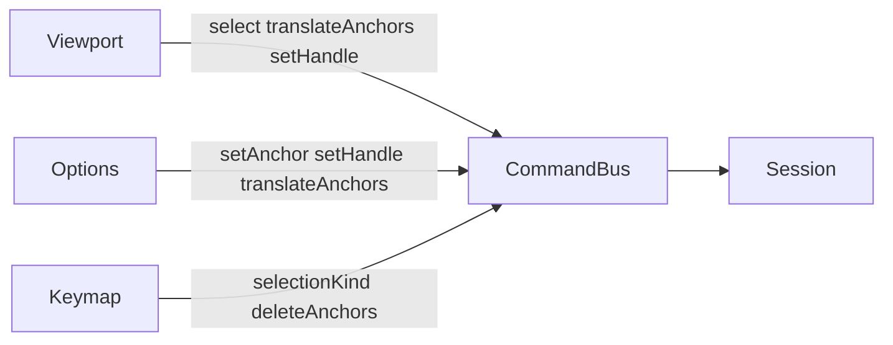

# Фаза 4. Edit Mode

Обсяг із [implementation.plan.md](c:\Projects\vscode-tools\vector-editor\.cursor\plans\implementation.plan.md), звужений двома рішеннями:

- Direct Select в Object Mode полотно не чіпає і режим не вмикає. Якорі виділяються лише в Edit Mode.
- У цій фазі лише якорі і handles. Клавіші `1` / `2` лише пишуть `editSelectionKind`. Хіт-тесту сегментів, `path.setSegmentKind` і line/cubic в Options немає.

Поза фазою: G/R/S, `object.delete`, перо, вставка якоря на сегменті. Open і Save лишаються `disabled`.

Зараз [applySessionCommand](c:\Projects\vscode-tools\vector-editor\src\app\core\session.service.ts) на `session.setMode` міняє лише `mode`. [Viewport](c:\Projects\vscode-tools\vector-editor\src\app\viewport\viewport.ts) обробляє ліву кнопку лише для Select в Object Mode. [Options](c:\Projects\vscode-tools\vector-editor\src\app\panels\options\components\options-panel.ts) в Edit показує «Nothing selected.» Handles у моделі абсолютні в локальному просторі об’єкта.

## Потік

`session.setMode`, `session.setTool`, `session.setViewport` і `session.setEditSelectionKind` History не пишуть. Знімок як і раніше: документ, режим, виділення.

## Режим

`session.setMode` лишає виділення об’єктів і скидає `selectedAnchorIds` та `selectedSegmentIds`. Вхід в Edit без активного об’єкта дозволений: оверлей порожній. Існуючі тести «sets the mode» і «keeps object selection when the mode changes» лишаються зеленими.

В Edit Mode малюється лише `source` активного об’єкта. Інші об’єкти з opacity близько 0.4 і влучань не беруть. Select в Edit Mode як і зараз нічого не робить: тест «ignores canvas clicks in edit mode» лишається.

У верхній смузі, лише в Edit, живий підпис `Anchors` або `Segments` від `editSelectionKind`.

## Команди шляху

Чисті функції в [src/app/core/model/edit-path.ts](c:\Projects\vscode-tools\vector-editor\src\app\core\model\edit-path.ts). Команди в [command.ts](c:\Projects\vscode-tools\vector-editor\src\app\commands\command.ts), обробка в сесії. `locked` активний об’єкт геометрію не міняє. Невідомі id ігноруються. Нульова зміна повертає той самий state, History запис не створює.

- `session.setEditSelectionKind` — `'anchor' | 'segment'`.
- `session.select` з `target: 'anchor'`. Працює лише в Edit і лише для якорів активного об’єкта. Об’єкти не чіпає. `clear` скидає лише якорі. `replace` / `add` / `toggle` як у об’єктів.
- `path.translateAnchors` — `objectId`, `anchorIds`, `dx`, `dy`, `gesture: 'begin' | 'continue'`. Зсув у локальному просторі додається до `position` і до наявних `handleIn` / `handleOut`, щоб форма кривої їхала разом із якорем.
- `path.setAnchor` — `objectId`, `anchorIds`, часткова позиція. Різниця так само зсуває handles. Одна команда на всі id.
- `path.setHandle` — `objectId`, `anchorIds`, `slot: 'in' | 'out'`, часткова або повна позиція, `breakLink`, необов’язковий `gesture`. Без `breakLink` наявний протилежний handle дзеркалиться через якір (`2 * position - handle`). Якщо протилежного handle немає, він не створюється. `breakLink: true` рухає лише цей slot.
- `path.deleteAnchors` — `objectId`, `anchorIds`. Якір зникає з виділення. Сегменти, що його торкались, замінюються мостом між сусідами: наявний сегмент між вцілілими лишається; новий міст `cubic`, якщо хоч один прибраний сегмент між ними був `cubic`, інакше `line`. Підшлях без якорів зникає. Один якір лишається відкритим і без сегментів. Об’єкт не видаляється.

Мітки: `Select`, `Move anchors`, `Set anchor`, `Move handle`, `Set handle`, `Delete anchors`. Жест `continue` замінює `after` останнього запису, якщо індекс на кінці і мітка збігається (`Move anchors` або `Move handle`), за тим самим правилом, що `object.translate` у [history.ts](c:\Projects\vscode-tools\vector-editor\src\app\commands\history.ts).

## Оверлей і Direct Select

Хіт-тест у [src/app/viewport/anchor-hit.ts](c:\Projects\vscode-tools\vector-editor\src\app\viewport\anchor-hit.ts). Поріг 6px екрана, від zoom не залежить. Радіус у локальному просторі: `6 / (zoom * max(|scaleX|, |scaleY|))`. Спочатку якір, потім handle, щоб ручка на якорі його не перехоплювала. Сегмент і заливка в цей тест не входять. `documentToLocal` з [hit-test.ts](c:\Projects\vscode-tools\vector-editor\src\app\viewport\hit-test.ts) експортується для переводу точки і дельти.

Оверлей у [viewport.html](c:\Projects\vscode-tools\vector-editor\src\app\viewport\viewport.html) лише в Edit для активного об’єкта, у його transform, `pointer-events: none`. Усі якорі `source` і всі ненульові handles з лініями до якоря. Виділений якір залитий `#1d4ed8`, решта — білі з синьою обводкою. Розмір ручок ділиться на zoom, щоб лишатися близько 6–8px.

Жест у [src/app/viewport/tools/direct-select.ts](c:\Projects\vscode-tools\vector-editor\src\app\viewport\tools\direct-select.ts), його кличе Viewport. Ліва кнопка лише коли `tool === 'direct-select'` і `mode === 'edit'`. Пробіл і середня кнопка лишаються pan. Поріг кліку 4px, як у Select.

- `pointerdown` по якорю: якщо не виділений, одразу `replace` (із Shift — `add`), далі перетяг шле `path.translateAnchors`. Уже виділений якір склад не міняє, тож їдуть усі виділені.
- `pointerdown` по handle: виділяє його якір і після порога шле `path.setHandle` з абсолютною локальною позицією курсора. Alt ставить `breakLink: true` на кожен рух.
- Промах і рух далі за поріг — рамка по якорях активного об’єкта. На `pointerup` без Shift — `replace`, із Shift — `add`. Клік у промах без Shift — `clear` якорів.
- `locked` виділяється, перетяг не починається.
- В Object Mode Direct Select нічого не диспатчить.

Курсор crosshair, поки активні Edit і Direct Select; під час перетягу якоря — `grabbing`.

## Options якоря

У [options-panel](c:\Projects\vscode-tools\vector-editor\src\app\panels\options\components\options-panel.ts) гілка Edit, коли виділені якорі активного об’єкта. Інакше в Edit лишається «Nothing selected.» — поточний тест після `setMode` без виділення якоря не ламається. Object Mode форма не змінюється.

Окрема Signal Form, координати локальні. Спільне значення показується, розбіжне числове поле порожнє. Запис на blur або Enter, повтор уже записаного значення команду не шле.

- Один якір, або кілька зі спільним числом: X, Y якоря (`path.setAnchor`); Handle in X/Y і Handle out X/Y (`path.setHandle`, `breakLink: true`). Порожнє і нечислове не шлеться. Handle, якого не було, з’являється, коли задані обидві координати slot.
- Кілька якорів: додаткові dX, dY. Ненульовий Enter/blur шле один `path.translateAnchors` і скидає чернетку зсуву в 0.

## Клавіатура

У [keymap.service.ts](c:\Projects\vscode-tools\vector-editor\src\app\keymap\keymap.service.ts), поза полем вводу:

- `1` і `2` лише в Edit, без модифікаторів: `session.setEditSelectionKind`.
- `Delete` і `X` лише в Edit, коли є виділені якорі: `path.deleteAnchors`. В Object Mode нічого не шлють.

V, A, P, Tab, Ctrl+Z, Ctrl+Shift+Z і Shift+D лишаються як є.

## Перевірка

Юніт-тести:

- хіт-тест: якір ближче за handle перемагає; handle далі за 6px влучає у свій slot; радіус не росте разом із zoom;
- `translateAnchors` зсуває позицію і обидва handles; жест із двох кроків знімається одним undo;
- `setHandle` без `breakLink` дзеркалить наявний протилежний handle і не створює відсутній; з `breakLink` протилежний стоїть;
- `deleteAnchors` прибирає якір, будує міст і відновлюється через Ctrl+Z;
- `setMode` скидає якорі і не пише History; Direct Select в Object Mode документ не міняє;
- keymap: `1`/`2`, Delete в Edit; Delete в Object Mode і в полі вводу не диспатчиться.

У браузері: New, клік по кривій, Tab показує якорі і підпис Anchors; A, перетяг якоря змінює криву, handles їдуть із ним; перетяг handle гне сегмент; Alt ламає зв’язку; Enter у полі X якоря ставить координату; Delete прибирає якір, Ctrl+Z повертає його; Select в Object Mode як і раніше рухає об’єкт, а не якір; Direct Select в Object Mode режим не вмикає; колесо, pan і V/A/P працюють як раніше.
