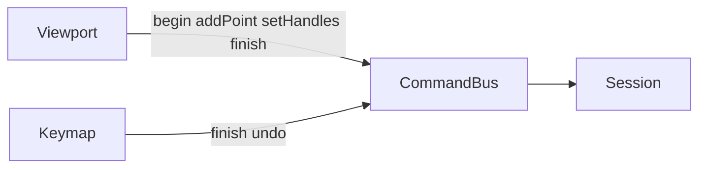

# Фаза 5. Перо

Обсяг із [implementation.plan.md](c:\Projects\vscode-tools\vector-editor\.cursor\plans\implementation.plan.md) і двох рішень цієї фази:

- Протяг під час кліку ставить `handleOut` і дзеркалить `handleIn`, тож щойно поставлений сегмент гнеться одразу. Alt лишає лише `handleOut`. Клік без протягу — кут, сегмент `line`.
- Поки штрих не початий: в Object Mode клік створює новий об’єкт. В Edit Mode клік дописує останній підшлях активного об’єкта, якщо він відкритий. Замкнений об’єкт (тестова крива після New) перо не чіпає і новий об’єкт не створює.

Поза фазою: новий підшлях на замкненому об’єкті, G/R/S, вставка якоря на сегмент, колір, файл. Open і Save лишаються `disabled`.

Зараз [Viewport](c:\Projects\vscode-tools\vector-editor\src\app\viewport\viewport.ts) на ліву кнопку кличе лише Direct Select або Select. [Command](c:\Projects\vscode-tools\vector-editor\src\app\commands\command.ts) команд пера не має. Знімок History як і раніше: документ, режим, виділення. Інструмент у знімок не входить.

## Потік

`penObjectId` живе в сесії поруч з інструментом і в знімок не пишеться. Його ставлять `pen.begin` і `pen.addPoint`, скидають `pen.finish`, зміна інструмента з Pen, вихід з Edit і `document.new`. Після undo/redo він лишається, лише якщо інструмент Pen, режим Edit, об’єкт є і його останній підшлях відкритий.

## Команди

Чисті функції в [src/app/core/model/pen-path.ts](c:\Projects\vscode-tools\vector-editor\src\app\core\model\pen-path.ts). Обробка в [session.service.ts](c:\Projects\vscode-tools\vector-editor\src\app\core\session.service.ts). `locked` геометрію не міняє. Немає документа або шару — `pen.begin` нічого не робить. Нульова зміна документа той самий state не замінює, крім скидання `penObjectId` на `pen.finish`.

Новий об’єкт: шар з найменшим `order`, ім’я `Path`, далі `Path 2`, `Path 3`. Стиль штриха `#1a1a1a`, `strokeWidth` 4, `fill: null`. Transform нульовий. Точки `pen.begin` у просторі документа, вони ж локальні. `pen.addPoint` і `pen.setHandles` отримують локальні координати.

- `pen.begin` — `position`. Об’єкт, один якір, відкритий підшлях без сегментів. Режим Edit, інструмент лишається Pen. Виділення: цей об’єкт і цей якір. `penObjectId` = id об’єкта.
- `pen.addPoint` — `objectId`, `position`. Лише якщо останній підшлях цього об’єкта відкритий. Новий якір і сегмент від попереднього: `cubic`, якщо в попереднього є `handleOut`, інакше `line`. Виділяє новий якір. Ставить `penObjectId`.
- `pen.setHandles` — `objectId`, `anchorId`, `handleOut`, `breakLink`, `gesture: 'continue'`. `handleOut` стає в точку курсора. Без Alt `handleIn` = `2 * position - handleOut`, і сегмент, що входить у цей якір, стає `cubic`. З Alt `handleIn` лишається `null`; вхідний сегмент `cubic` лише коли в попереднього є `handleOut`, інакше `line`.
- `pen.finish` — `objectId`, `closed`. Скидає `penObjectId`. `closed: false` лише завершує штрих; прапор уже відкритий, тож документ може не змінитися і запис History не з’явиться. `closed: true` лише коли якорів щонайменше два: підшлях замикається і додається сегмент з останнього якоря в перший, `cubic`, якщо є `handleOut` кінця або `handleIn` старту, інакше `line`.

Мітки: `Pen` для begin, addPoint і setHandles; `Close path` для замикання. `pen.setHandles` з `gesture: 'continue'` зливається з останнім записом `Pen`, як перетяг у [history.ts](c:\Projects\vscode-tools\vector-editor\src\app\commands\history.ts). Один клік із протягом знімається одним undo разом із ручками.

## Інструмент

Жест у [src/app/viewport/tools/pen.ts](c:\Projects\vscode-tools\vector-editor\src\app\viewport\tools\pen.ts), його кличе Viewport, коли `tool === 'pen'`. Пробіл і середня кнопка лишаються pan. Поріг протягу 4px. Курсор `crosshair`.

На `pointerdown` ціль така:

- є `penObjectId` — цей об’єкт;
- інакше в Edit, в активного об’єкта останній підшлях відкритий і об’єкт не `locked` — він;
- інакше в Object Mode — `pen.begin`;
- інакше клік ігнорується.

Для вже наявного відкритого підшляху влучання в перший якір рахується тим самим радіусом 6px, що в [anchor-hit.ts](c:\Projects\vscode-tools\vector-editor\src\app\viewport\anchor-hit.ts), незалежно від zoom. Два і більше якорів — `pen.finish` з `closed: true`, протяг замикання ручки не ставить. Один якір — клік у нього ігнорується. Будь-який інший клік — `pen.addPoint`, навіть біля середніх якорів. Протяг далі за поріг шле `pen.setHandles`; Alt читається на кожен рух.

Після відпускання, поки `penObjectId` стоїть, рух курсора малює гумову лінію від останнього якоря до курсора в його transform: `line`, якщо `handleOut` немає, інакше `cubic` з цим `handleOut`. У документ вона не пишеться. Під час протягу ручки її немає: ручки вже малює оверлей Edit. Оверлей фази 4 лишається як є.

## Клавіатура

У [keymap.service.ts](c:\Projects\vscode-tools\vector-editor\src\app\keymap\keymap.service.ts), поза полем вводу і лише коли `penObjectId` заданий:

- Enter без модифікаторів і лише у фокусі viewport: `pen.finish` з `closed: false`. Enter в Options і Outliner не забирається.
- Escape: `history.undo` останньої точки. Якщо це був `pen.begin`, об’єкт зникає і режим повертається зі знімка.

V, A, P, Tab, Ctrl+Z і Delete лишаються. Зміна інструмента або Tab в Object Mode скидає `penObjectId`, намальовані точки лишаються відкритим шляхом.

## Перевірка

Юніт-тести:

- `pen.begin` створює відкритий об’єкт, входить в Edit і виділяє якір; повторний undo прибирає об’єкт і режим;
- клік без протягу дає `line`; протяг дзеркалить `handleIn` і робить вхідний сегмент `cubic`; Alt `handleIn` не створює; два кроки протягу — один запис History;
- клік у перший якір замикає і додає сегмент назад; Enter завершує штрих без `closed`;
- в Edit відкритий шлях приймає `pen.addPoint`; замкнений об’єкт і Edit без відкритого підшляху документ не міняють;
- keymap: Enter у viewport і Escape під час штриха; Enter у полі вводу і Escape без штриха не диспатчаться.

У браузері: New, P, клік в Object Mode створює шлях і показує якір; протяг гне сегмент, Alt ламає пару ручок; клік без протягу лишає прямий сегмент; гумова лінія йде за курсором; клік у старт замикає; Ctrl+Z знову відкриває; Enter на новому штриху лишає шлях відкритим, наступний клік пера в Edit дописує його; A рухає нові якорі; на замкненій тестовій кривій в Edit перо нічого не додає; колесо, pan і V/A/P працюють як раніше.
