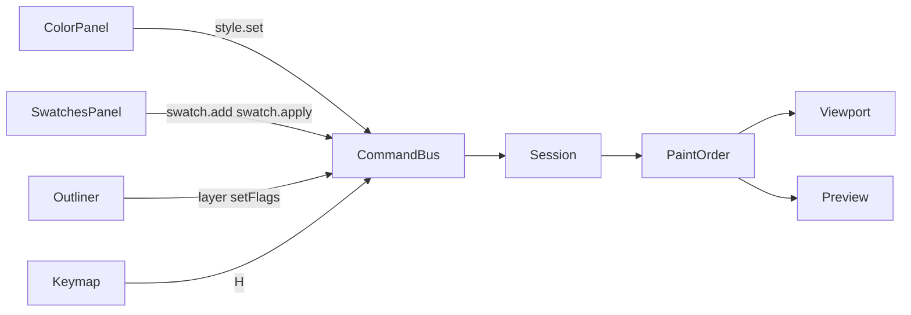

# Фаза 6. Колір, шари, preview

Обсяг із [implementation.plan.md](c:\Projects\vscode-tools\vector-editor\.cursor\plans\implementation.plan.md) і двох рішень цієї фази:

- У Outliner можна додати шар, перейменувати його і змінити порядок. Око і замок є і в шару, і в об’єкта.
- У панелі Color активна комірка — Fill або Stroke. Клік по зразку пише колір у неї. Новий зразок береться з поточного спільного fill.

Поза фазою: `object.reorder` (об’єкт між шарами), `fillRule`, градієнти, evaluated-модифікатори. Preview малює той самий `source` і transform, що й полотно: окремих evaluated-шляхів ще немає, вони з’являться у фазах 9–10. Open і Save лишаються `disabled`. Порядок шарів — кнопки вгору і вниз, не drag-drop: його залишено стеку модифікаторів.

Зараз [Color](c:\Projects\vscode-tools\vector-editor\src\app\panels\color\components\color-panel.ts), [Swatches](c:\Projects\vscode-tools\vector-editor\src\app\panels\swatches\components\swatches-panel.ts) і [Preview](c:\Projects\vscode-tools\vector-editor\src\app\panels\preview\components\preview-panel.ts) — порожні секції. [Outliner](c:\Projects\vscode-tools\vector-editor\src\app\panels\outliner\components\outliner-panel.html) показує імена без ока, замка і команд шару. `object.setFlags` уже ховає і блокує об’єкт; `layer.*`, `style.set` і `swatch.*` у [command.ts](c:\Projects\vscode-tools\vector-editor\src\app\commands\command.ts) відсутні. [objectsInPaintOrder](c:\Projects\vscode-tools\vector-editor\src\app\core\model\paint-order.ts) враховує лише `object.visible`, тож замок і видимість шару полотно не змінюють.

## Потік

Активна комірка живе сигналом панелі Color і в знімок History не входить. Нульова зміна документа запис не створює, як і зараз у `commitSession`.

## Команди

Чисті функції в новому `src/app/core/model/document-edits.ts`, обробка в [session.service.ts](c:\Projects\vscode-tools\vector-editor\src\app\core\session.service.ts). Колір — `#rrggbb` у нижньому регістрі; інше значення команда відкидає. `strokeWidth` лише скінченне і невід’ємне. Невідомий id нічого не міняє.

- `style.set` — `objectIds` і частковий `Style` без `fillRule`. Пише лише передані поля у виділені об’єкти. Мітка: `Set fill`, `Set stroke` або `Set stroke width` за єдиним зміненим полем; інакше `Set style`.
- `swatch.add` — `name`, `color`. Додає зразок у кінець `Document.swatches`. Порожнє ім’я після trim відхиляється. Мітка `Add swatch`.
- `swatch.apply` — `swatchId`, `target: 'fill' | 'stroke'`, `objectIds`. Той самий запис стилю, що `style.set` для одного поля. Немає зразка або об’єктів — нічого. Мітка `Apply swatch`.
- `layer.add` — без payload. Ім’я `Layer`, далі `Layer 2`. Новий шар видимий, не заблокований, `order` на 1 більший за поточний максимум, тож у списку він зверху. Мітка `Add layer`.
- `layer.update` — `id`, `name?`, `visible?`, `locked?`. Порожнє ім’я не пишеться. Мітки: `Rename layer`, `Show layer`, `Hide layer`, `Lock layer`, `Unlock layer`.
- `layer.reorder` — `id`, `index`. `index` — місце у списку спереду назад, `0` це верх Outliner і передній план. Після зсуву `order` нормалізується: задній шар `0`, передній найбільший. Крайній шар далі за край не їде. Мітка `Reorder layer`.

`H`, коли є виділені об’єкти і фокус не в полі: якщо всі видимі — `object.setFlags` з `visible: false`, інакше `visible: true`. У [keymap.service.ts](c:\Projects\vscode-tools\vector-editor\src\app\keymap\keymap.service.ts).

## Видимість і замок

Об’єкт потрапляє в [objectsInPaintOrder](c:\Projects\vscode-tools\vector-editor\src\app\core\model\paint-order.ts) лише коли видимі і він, і його шар. Хіт-тест уже читає цей список, тож схований шар або об’єкт не виділяється кліком і не входить у рамку. Око шару не змінює `object.visible`.

Замок жесту: об’єкт не рухається, якщо `object.locked` або шар заблокований. Ця перевірка в `object.translate`, замінах `source`, pen add/finish і в `canMove` Select, Direct Select і пера. `pen.begin` як і раніше кладе об’єкт на шар із найменшим `order`; якщо той шар заблокований або схований, команда нічого не робить. Options і далі може ставити transform і прапори: замок забороняє перетяг, не поля панелі. `style.set` на заблокованому об’єкті працює.

## Панелі

**Color.** Замість заглушки: якщо об’єктів не виділено — «No color yet.» Інакше дві комірки Fill і Stroke, `aria-pressed` на активній. Нативна `<input type="color">` пише в активну комірку на `change`. Кнопка None ставить `null` в активну. Розбіжний колір не показує чужий hex, доки користувач сам не вибере колір. `strokeWidth` — Signal Forms, як координати в Options: у документ на blur або Enter; порожнє поле, коли значення розходяться.

**Color Collections.** Кнопка на кожен зразок: фон — колір, ім’я — доступна назва. Клік шле `swatch.apply` в активну комірку для поточних `selectedObjectIds`. Кнопка Add swatch бере спільний fill виділення; вона неактивна, коли fill немає або він різний. Імена `Swatch`, `Swatch 2`. Порожній список лишає «No swatches yet.»

**Outliner.** Над деревом кнопка Add layer. У рядку шару: око, замок, поле імені (blur або Enter → `layer.update`), кнопки вгору і вниз. Клік по рядку як і раніше згортає шар. У рядку об’єкта: око і замок через `object.setFlags`, клік по імені виділяє. Кнопки з `aria-label` на кшталт «Hide Curve» і `aria-pressed`; їхній клік не спливає в рядок. Стрілки дерева не перехоплюють клавіші, коли фокус у полі імені.

**Preview.** Другий SVG з `sceneFromDocument`: лише видимі шляхи, `viewBox` документа, без виділення, якорів, пера і камери. `pointer-events: none`, сам SVG `aria-hidden="true"`. Немає документа або видимих шляхів — «Nothing to preview.»

## Перевірка

Юніти: фарба ховає шар і об’єкт окремо; стиль, зразок і шар не пишуть історію на нульовій зміні; замок шару не зсуває transform; `H` ховає і знову показує; Outliner лишає стрілки й Enter. У браузері: fill і stroke міняють полотно і preview; зразок пише в активну комірку; новий шар з’являється зверху і перейменовується; вгору і вниз міняють порядок малювання; око ховає об’єкт і цілий шар; замок забороняє перетяг на полотні.
