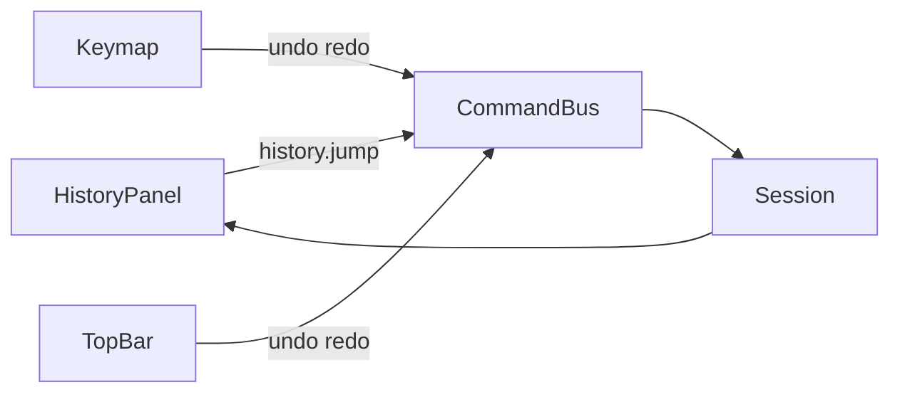

# Фаза 7. Панель History

Обсяг із [implementation.plan.md](c:\Projects\vscode-tools\vector-editor\.cursor\plans\implementation.plan.md):

- Список міток від старіших до новіших. Поточний крок — `history.index`. Кроки після індексу лишаються в списку, але сірі.
- Клік по іншому рядку шле `history.jump` і підставляє знімок цього кроку. Нова команда, як і зараз у `recordHistory`, відрізає гілку redo.
- Окремого рядка «до першого кроку» немає. Повний undo (`index === -1`) як і раніше тільки кнопкою Undo і Ctrl+Z: тоді жоден рядок не поточний, усі сірі.

Поза фазою: нові команди документа, зміна того, що входить у знімок (viewport, інструмент, `penObjectId`), drag-drop історії. Open і Save лишаються `disabled`.

Зараз [HistoryPanel](c:\Projects\vscode-tools\vector-editor\src\app\panels\history\components\history-panel.ts) завжди пише «No history yet.». [history.ts](c:\Projects\vscode-tools\vector-editor\src\app\commands\history.ts) уже тримає `entries` (`label`, `before`, `after`) і `index`. [commitSession](c:\Projects\vscode-tools\vector-editor\src\app\core\session.service.ts) вміє `history.undo` і `history.redo` і кличе `reconcilePen`. Команди `history.jump` у [command.ts](c:\Projects\vscode-tools\vector-editor\src\app\commands\command.ts) немає. Ctrl+Z і Ctrl+Shift+Z у [keymap.service.ts](c:\Projects\vscode-tools\vector-editor\src\app\keymap\keymap.service.ts) уже ходять на крок назад і вперед; панель лише показує той самий індекс.

## Потік

Панель тільки читає `session.history` і шле одну команду. Undo, redo і jump запис у History не створюють.

## Команда

`history.jump` з цілим `index`. Обробка в `commitSession` поруч із undo і redo, до `historyLabel`.

- `index` збігається з поточним, не цілий, менший за `-1` або не менший за довжину `entries` — стан той самий.
- `index >= 0` підставляє `entries[index].after`.
- `index === -1` підставляє `entries[0].before`, якщо записи є. Панель цей індекс не шле.
- Відновлюються `document`, `mode` і `selection`. Viewport і інструмент не чіпаються. Далі той самий `reconcilePen`, що після undo: відкритий штрих пера скидається, якщо відновлений стан його не тримає.
- `entries` не змінюються, міняється лише `index`.

У `historyLabel` гілка `history.jump` повертає `null`, щоб тип лишався вичерпним.

## Панель

Замість заглушки в [history-panel.ts](c:\Projects\vscode-tools\vector-editor\src\app\panels\history\components\history-panel.ts), шаблон і стилі поруч. Секція з `aria-labelledby` лишається.

Порожній `entries` — текст «No history yet.». Інакше `<ol>` кнопок `type="button"` у порядку масиву: зверху найстаріший крок.

- Поточний рядок (`index === history.index`): `aria-current="step"` і акцентна смуга, як у натиснутої кнопки оболонки.
- Майбутній рядок (`index > history.index`): клас із кольором `--chrome-muted`. Кнопка не `disabled`, тож клік і Enter стрибають уперед тим самим `history.jump`.
- Минулий рядок виглядає як звичайна кнопка.
- Клік по поточному рядку команду не шле.

Список не має власної прокрутки: колонка панелей уже `overflow: auto`. Після зміни індексу поточна кнопка викликає `scrollIntoView({ block: 'nearest' })`, щоб Undo з клавіатури не ховав рядок за межами aside.

## Перевірка

Юніти в [command-bus.service.spec.ts](c:\Projects\vscode-tools\vector-editor\src\app\commands\command-bus.service.spec.ts): jump на старіший індекс відновлює документ, режим і виділення цього `after` і не додає запис; jump уперед збігається з кількома redo; чужий індекс і повтор поточного нічого не міняють; команда після jump відрізає сірі кроки. Окремий [history-panel.spec.ts](c:\Projects\vscode-tools\vector-editor\src\app\panels\history\components\history-panel.spec.ts): порожній текст, порядок міток, `aria-current` на поточному, сірий клас на майбутніх, клік шле jump.

У браузері: кілька окремих рухів дають кілька рядків; один перетяг — один рядок; клік старішого відкочує документ і виділення; сірі кроки після цього кликабельні вперед; новий рух їх прибирає; Ctrl+Shift+Z зсуває поточний рядок уперед по списку.
