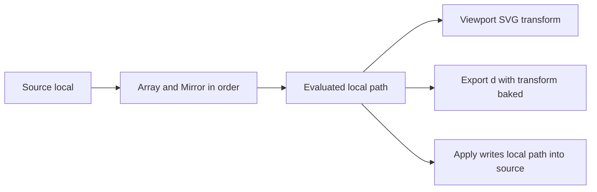

# Фаза 9. Array і Mirror

Обсяг із [implementation.plan.md](c:\Projects\vscode-tools\vector-editor\.cursor\plans\implementation.plan.md): панель стека, evaluated для Array і Mirror, порядок, Apply і JSON у `data-vector-editor`. Bevel, Boolean, `clipper2-ts` і відкладення Clipper до `pointerup` лишаються фазі 10.

Нового пакета немає. Порядок рядків — `DragDropModule` з уже наявного `@angular/cdk/drag-drop`.

## Що рахується

Чисті функції в `src/app/core/eval/`. Вхід кроку — `SourcePath` у локальному просторі. Модифікатори йдуть з індексу 0 до кінця: верхній рядок панелі застосований першим. `enabled: false` пропускає крок і не скидає параметри. `bevel` і `boolean`, якщо колись опиняться в масиві, теж пропускаються і пишуть діагностику; кнопки їх не додають.

Після стека `transform` лишається на об’єкті. Viewport і далі малює локальний `d` плюс наявний SVG-transform із [scene.ts](c:\Projects\vscode-tools\vector-editor\src\app\viewport\scene.ts). Export, як і зараз, запікає ту саму матрицю в атрибут `d`.

Зсув Array — у локальних одиницях viewBox, до rotate/scale. Копії їдуть разом з об’єктом. Вісь Mirror проходить через центр bounds поточного входу стека.

**Array.** `count` включає оригінал, ціле, мінімум 1. Репліка `i` — копія всіх підшляхів, зсунута на `i * offsetX`, `i * offsetY`. Якорі, handles і вид сегмента (`line` або `cubic`) зберігаються. Відкритий шлях лишається відкритим.

**Mirror.** Bounds — AABB якорів і handles входу. `x` відбиває Y через центр, `y` відбиває X, `xy` — обидві осі. Копія додається окремими підшляхами, кінці на осі не зшиваються.

Живий evaluated не кличе `createId()`: id копій детерміновані від id джерела й індексу репліки, щоб `computed()` лишався чистим. У `d` ці id не потрапляють.

## Команди

У [command.ts](c:\Projects\vscode-tools\vector-editor\src\app\commands\command.ts) і обробник у [session.service.ts](c:\Projects\vscode-tools\vector-editor\src\app\core\session.service.ts), кожна з міткою History:

- `modifier.add` — `{ objectId, kind: 'array' | 'mirror' }`. У кінець стека. Array: `count: 3`, `offsetX: 40`, `offsetY: 0`. Mirror: `axis: 'x'`. Обидва `enabled: true`.
- `modifier.update` — частковий patch одного модифікатора. `count` на команді вже ціле `>= 1`; порожнє поле панель не шле.
- `modifier.remove`, `modifier.reorder` — `{ objectId, modifierId, index }`.
- `modifier.apply` — `source` стає локальним evaluated префікса до цього модифікатора включно, префікс зникає зі стека. Усі id якорів і сегментів нові через `createId()`. Якщо це активний об’єкт, виділення якорів і сегментів скидається.
- `modifier.applyAll` — повний стек у `source`, масив модифікаторів порожній, те саме скидання виділення.

`transform` Apply не чіпає. Жести ці команди не зливають. Дублювання об’єкта вже клонує стек у [duplicate-objects.ts](c:\Projects\vscode-tools\vector-editor\src\app\core\model\duplicate-objects.ts).

## Панель

Заглушка [modifiers-panel.ts](c:\Projects\vscode-tools\vector-editor\src\app\panels\modifiers\components\modifiers-panel.ts) стає панеллю з зовнішнім шаблоном, як Options. Стек — активного об’єкта.

Без активного об’єкта: «Select an object.» Інакше кнопки Add array і Add mirror, список рядків і Apply all, коли стек не порожній. Рядок: ручка перетягування, назва, checkbox Enabled, параметри, Apply, Remove. Числа — Signal Forms; у документ на blur або Enter, як в Options. Вісь Mirror — група з трьох радіокнопок. Діагностика, якщо є, — текст під стеком.

`cdkDropList` міняє порядок тією самою `modifier.reorder`. Клавіатурне перетягування CDK лишається на ручці.

## Хто читає evaluated

- [scene.ts](c:\Projects\vscode-tools\vector-editor\src\app\viewport\scene.ts): `d` з evaluated-шляху. Preview іде через ту саму сцену. Якорі Edit Mode лишаються на `source`.
- [hit-test.ts](c:\Projects\vscode-tools\vector-editor\src\app\viewport\hit-test.ts): клік і рамка б’ють по evaluated-контуру в локальному просторі, далі той самий transform. Клік по копії виділяє об’єкт.
- [svg-export.ts](c:\Projects\vscode-tools\vector-editor\src\app\core\io\svg-export.ts): `d` — evaluated плюс transform. All data і Optimized пишуть справжній масив `modifiers` замість `[]`. Optimized без id модифікаторів. Minimal як і раніше без JSON: у файлі лише запечений `d`.
- [svg-import.ts](c:\Projects\vscode-tools\vector-editor\src\app\core\io\svg-import.ts): читає `array` і `mirror`, відновлює id в All data і видає нові в Optimized. Битий елемент і `bevel` / `boolean` відкидає. Тест, який зараз очікує порожній стек, змінюється на відновлення валідного Array.

Options і далі рахує підшляхи й якорі джерела, не evaluated.

## Перевірка

Юніти eval: Array з `count: 3` дає три копії зі зсувом і зберігає cubic; Mirror по X відбиває handles; вимкнений крок нічого не міняє; Array після Mirror тиражує вже відбиту форму, зворотний порядок дає інший bounds. Apply лишає копії в `source` і прибирає префікс; Undo повертає стек.

Юніти io: All data відновлює стек і локальний `source`, а `d` містить evaluated у просторі документа; Optimized дає нові id модифікаторів; Minimal не пише атрибут редактора.

У браузері: додати Array і Mirror, поміняти порядок і побачити іншу форму; перетяг копії виділяє об’єкт; Apply лишає копії після зникнення рядка; Save All data відкривається зі стеком, а збережений `d` у звичайному переглядачі показує копії.
