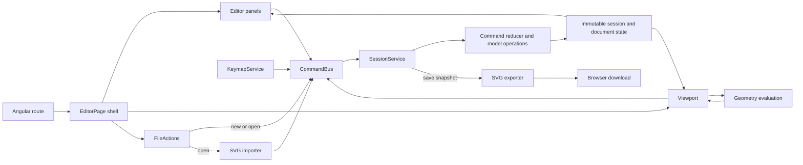

# Vector Editor: Technical Overview

This guide is a code-oriented map for contributors and future coding sessions. It describes the current implementation, not an aspirational architecture.

## Project Snapshot

- Browser-based vector editor built with Angular 22, TypeScript 6, and SCSS.
- Single Angular application: `vector-editor`, rooted at `src/`.
- SVG is the import/export and save format. The inspected code has no backend or separate persisted project format; the active document lives in the in-memory editor session.
- Geometry operations use local pure TypeScript modules. Boolean geometry is backed by `clipper2-ts`.

## Start Here

- App bootstrap: [src/main.ts](src/main.ts), [src/app/app.config.ts](src/app/app.config.ts), [src/app/app.routes.ts](src/app/app.routes.ts).
- Main editor composition: [src/app/shell/components/editor-page/editor-page.ts](src/app/shell/components/editor-page/editor-page.ts) and its template.
- Central state and command application: [src/app/core/session.service.ts](src/app/core/session.service.ts).
- Domain types: [src/app/core/model/types.ts](src/app/core/model/types.ts).
- Command vocabulary and undo history: [src/app/commands/models/command.ts](src/app/commands/models/command.ts), [src/app/commands/models/history.ts](src/app/commands/models/history.ts).
- Canvas behavior: [src/app/viewport/components/viewport/viewport.ts](src/app/viewport/components/viewport/viewport.ts).
- SVG conversion: [src/app/core/io/svg-import.ts](src/app/core/io/svg-import.ts), [src/app/core/io/svg-export.ts](src/app/core/io/svg-export.ts).

## Architecture

The application is a client-side Angular editor organized around a single in-memory session. The shell composes the user interface; feature UI sends intent through commands; core code owns state transitions and domain operations; the viewport renders derived geometry. SVG import/export is the document boundary to the outside world.



The main dependency direction is from UI and interaction code toward typed commands and core domain operations. Core model/evaluation code does not depend on panel components. The viewport owns pointer gesture and coordinate handling, but document mutations still go through `CommandBus`; display geometry is derived from source geometry rather than stored as a second editable document. `FileActions` is the browser-facing adapter for file selection and downloads, while SVG parsing/serialization stays in `core/io/`.

## Runtime and State Flow

The root route lazy-loads `EditorPage`. That page composes the top bar, tool rail, viewport, dialogs, and editor panels; constructing it also initializes `KeymapService`.

The normal mutation path is:

1. A component or interaction handler creates a discriminated-union `Command`.
2. `CommandBus.dispatch()` forwards it to `SessionService.apply()`.
3. `commitSession()` applies it through the session reducer, reconciles related session state, and records an undo snapshot when the command is history-bearing and changes the snapshot.
4. Components read computed signals from `SessionService`; the viewport derives its scene from the current document and evaluated geometry.

`SessionService` is the owner of session state. UI components should dispatch commands rather than directly edit document objects. Domain/model helpers generally return new readonly values and are called from the reducer.

History snapshots include the document, editor mode, and selection. Tool, viewport camera, and selected layer are not snapshot fields. Non-history commands (such as camera movement and tool changes) are labeled `null`; pointer-drag commands can coalesce into one history entry through their `gesture` field.

## Domain Model and Geometry

The public document model is defined in [src/app/core/model/types.ts](src/app/core/model/types.ts):

- A `Document` has a viewBox, ordered layers, vector objects, and swatches.
- A `VectorObject` has editable `source` paths, style, transform, visibility/lock flags, and an ordered modifier stack.
- A `SourcePath` consists of subpaths, anchors, and segments. Anchors have positions and optional in/out handles; segments reference anchor IDs and are lines or cubics.
- Modifiers are a tagged union: array, mirror, bevel, round, boolean, and image
  trace. Trace is an image-only modifier whose regions are previewed from stored
  vector paths and expanded into paths when applied; it is not run as a geometry
  step in the regular evaluator. See [IMAGE_TRACE.md](IMAGE_TRACE.md) for its
  data flow, algorithm, persistence contract, and change map.

The source path is the editable geometry. Evaluation in [src/app/core/eval/evaluate.ts](src/app/core/eval/evaluate.ts) walks enabled modifiers in order to derive display/export geometry. It memoizes object evaluation, reports diagnostics for unsupported/invalid operations, and detects cyclic boolean dependencies. Boolean modifiers refer to another object's ID. `ClipperHold` captures intermediate modifier results during relevant drag interactions so boolean-derived geometry can remain stable while transforms are updated.

The `core/model/` directory contains document edits, path edits, paint/layer order, transforms, ID creation, and SVG path-data conversion. Keep geometry/model changes pure where practical; keep DOM interaction and Angular state out of these helpers.

## Main Feature Areas

- `src/app/core/`: document types, pure model operations, session state, geometry evaluation, matrices, SVG parsing and serialization.
- `src/app/commands/`: command types, history state/labels/coalescing, and the command bus.
- `src/app/viewport/`: SVG canvas component plus camera, hit testing, snapping, scene creation, and tool-specific interaction helpers. The viewport translates pointer/keyboard gestures into commands.
- `src/app/keymap/`: global keyboard shortcuts. Typing targets are excluded; viewport-only shortcuts check the viewport marker.
- `src/app/shell/`: editor page composition, top bar/tool rail, new/save dialogs, and file actions.
- `src/app/panels/`: tools, outliner/layers, options, modifiers, color, swatches, preview, and history UI.
- `src/app/shared/`: shared panel and reusable UI components.
- `src/styles/` and `src/styles.scss`: global resets, panel styles, and icon/font styling.

Panel modules are exposed through `@vector-editor/panels/*` path aliases. The codebase currently mixes standalone components with NgModule-based panels; follow the local feature's existing pattern unless a task explicitly migrates it.

## SVG Interchange

`FileActions` creates a hidden file input, reads selected SVG text, calls `importSvg()`, and dispatches `document.replace`. Saving calls `exportSvg()` and downloads a Blob. Both paths are local browser operations.

The importer parses standard SVG shapes and path data into the internal model and counts unsupported/skipped nodes. Export modes are `all`, `optimized`, and `minimal`. Non-minimal exports include `data-vector-editor-*` metadata so editor-specific data can round-trip; optimized metadata uses indexed path references and boolean operand indexes. Minimal export emits standard SVG geometry/style without editor metadata, so it is intended for interchange rather than preserving the full editable model.

When changing import/export behavior, preserve both standard SVG compatibility and the metadata round-trip contract. Relevant coverage is in [src/app/core/io/svg-io.spec.ts](src/app/core/io/svg-io.spec.ts).

## Working Conventions

- Angular/compiler version is 22; standalone components are the preferred direction, but existing NgModule panels remain in use.
- State is signal-based. Use the existing session signals and typed commands; avoid introducing a second document-state owner.
- TypeScript strictness is enabled. Prefer explicit domain types and avoid `any`.
- Public feature boundaries are exported through `index.ts` barrels and configured in [tsconfig.json](tsconfig.json). Prefer `@vector-editor/*` imports across feature boundaries; relative imports are common within a feature.
- Templates use Angular control flow in newer code. Existing components may still reflect older module-era conventions.
- Keep canvas math and geometry helpers independently testable; add interaction tests at the viewport boundary when behavior depends on browser events.

## Tests and Commands

The Angular unit-test target uses Vitest. Existing specs cover model edits, transforms, SVG I/O, geometry evaluation, viewport helpers/interactions, keymap, panels, and file actions.

```powershell
npm start
npm test
npm run build
```

`npm start` serves the editor at `http://localhost:4200/` by default. The production build is the default for `npm run build`; the development configuration enables source maps and disables optimization.

## Change Routing

- Document shape, selection rules, or command application: start in `core/session.service.ts`, then the relevant `core/model/` helper and model spec.
- Undo/redo labels or gesture merging: inspect `commands/models/history.ts` and session history tests.
- Canvas gesture, hit target, snapping, or coordinate bug: inspect `viewport.ts` and the nearest utility under `viewport/utils/`; dispatch should remain command-based.
- Modifier result or diagnostics: inspect `core/eval/evaluate.ts` and the specific evaluator in `core/eval/`.
- Image trace behavior: start with [IMAGE_TRACE.md](IMAGE_TRACE.md), then follow its UI, rasterization, preview, Apply, or SVG links for the affected path.
- SVG round-trip or export fidelity: inspect `core/io/` and `svg-io.spec.ts`.
- A panel/control change: inspect that panel's component, template, and spec, and use `CommandBus` for document mutations.
- Keyboard behavior: inspect `keymap/services/keymap.service.ts` and its spec.